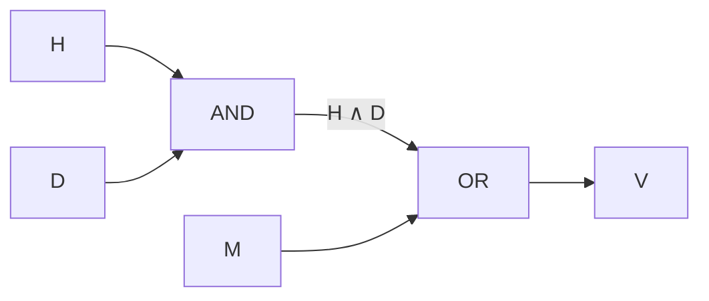
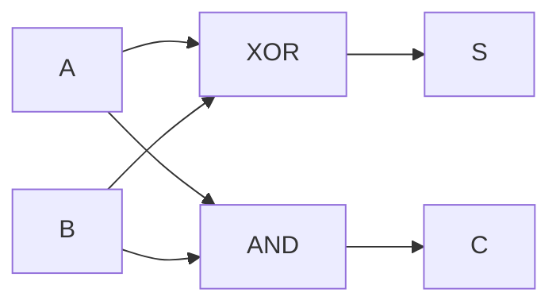
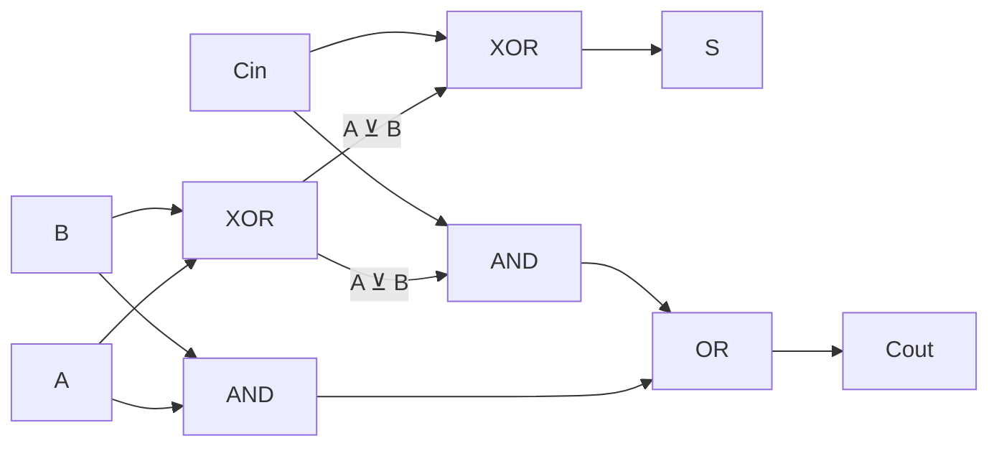
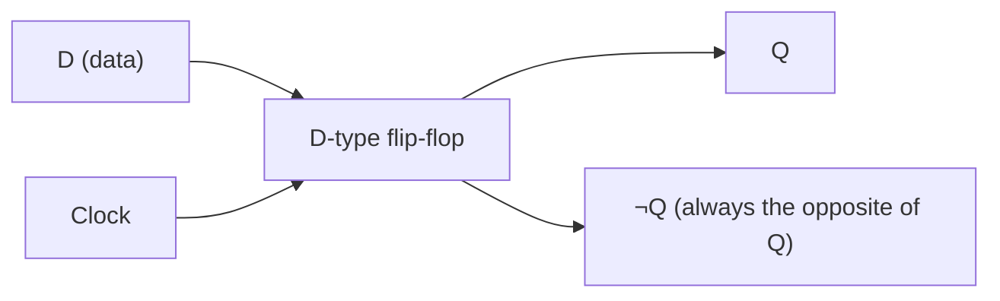

## Notation

OCR's questions write Boolean expressions with these symbols. In your answers OCR also accepts other common notations: `A.B` or `A AND B`, `A+B` or `A OR B`, `~A`, `NOT A` or a bar over the letter, `A ⊕ B` or `A XOR B`, and `↔` for equivalence. When a question asks for a logic diagram, draw the gates instead.

| Operation | Written | True when |
| --- | --- | --- |
| AND (conjunction) | `A ∧ B` | both inputs are true |
| OR (disjunction) | `A ∨ B` | at least one input is true |
| NOT (negation) | `¬A` | the input is false |
| XOR (exclusive disjunction) | `A ⊻ B` | exactly one input is true |
| Equivalence (iff) | `A ≡ B` | both sides have the same value |

`≡` is read "is equivalent to" or "if and only if": the two sides give the same output for every combination of inputs. So `V ≡ (H ∧ D) ∨ M` below says that `V` is true exactly when `(H ∧ D) ∨ M` is true.

OCR's truth tables use **T** (true) and **F** (false). In adders, Karnaugh maps and the identities below, **1** means true and **0** means false.

## Defining problems with Boolean logic

Turn each condition into a variable, then join them with the operators the wording describes.

A greenhouse ventilation fan (`V`) should run when it is hot (`H`) and the door is closed (`D`), or whenever the manual switch (`M`) is on:

`V ≡ (H ∧ D) ∨ M`

A truth table lists the output for every combination of inputs. With *n* inputs there are 2n rows, so three inputs need 8 rows.

## Logic gate diagrams and truth tables

Each operator has its own gate symbol. You need to recognise and draw them.

| Gate | Shape | Expression |
| --- | --- | --- |
| AND | Flat back and a round, D-shaped front | `A ∧ B` |
| OR | Curved back and a pointed front | `A ∨ B` |
| NOT | A triangle with a small circle at its point | `¬A` |
| XOR | An OR shape with an extra curved line across the inputs | `A ⊻ B` |

To go from an expression to a diagram, draw one gate for each operator, working outwards from the innermost brackets. For `V ≡ (H ∧ D) ∨ M`, `H` and `D` feed an AND gate, and its output and `M` feed an OR gate.

The diagrams on this page show each gate as a box with its name, and the wires as arrows from inputs to output. In the exam, draw the gate symbols described in the table above, and label every input and the output.

To go from a diagram to a truth table, add a column for each gate's output, work each one out row by row, and finish with the final output:

| `H` | `D` | `M` | `H ∧ D` | `V` |
| :-: | :-: | :-: | :-: | :-: |
| F | F | F | F | F |
| F | F | T | F | T |
| F | T | F | F | F |
| F | T | T | F | T |
| T | F | F | F | F |
| T | F | T | F | T |
| T | T | F | T | T |
| T | T | T | T | T |

## Rules for simplifying

Each rule except double negation has an AND form and an OR form.

- **Commutation:** the order of inputs does not matter.\
  `A ∧ B ≡ B ∧ A`\
  `A ∨ B ≡ B ∨ A`
- **Association:** with the same operator throughout, the grouping does not matter.\
  `(A ∧ B) ∧ C ≡ A ∧ (B ∧ C)`\
  `(A ∨ B) ∨ C ≡ A ∨ (B ∨ C)`
- **Distribution:** multiply out a bracket, or take out a common factor.\
  `A ∧ (B ∨ C) ≡ (A ∧ B) ∨ (A ∧ C)`\
  `A ∨ (B ∧ C) ≡ (A ∨ B) ∧ (A ∨ C)`
- **De Morgan's laws:**\
  `¬(A ∧ B) ≡ ¬A ∨ ¬B`\
  `¬(A ∨ B) ≡ ¬A ∧ ¬B`\
  Books differ on which of these is the "first" law, so learn both.
- **Double negation:**\
  `¬¬A ≡ A`

To remove a `¬` from outside a bracket with **De Morgan's laws**: change the operator (AND becomes OR, OR becomes AND) and negate each term inside, then cancel any double negations. Students often negate the terms but forget to change the operator.

OCR also asks for the reverse: putting a `¬` back outside a bracket. Negate each term, change the operator, and negate the whole bracket. `¬A ∨ ¬B` becomes `¬(¬¬A ∧ ¬¬B)`, which is `¬(A ∧ B)` after cancelling the double negations.

This shortcut only applies when the whole bracket is negated. `A ∧ B` on its own does **not** become `¬A ∨ ¬B`; it is equivalent to `¬(¬A ∨ ¬B)`.

Other useful identities:

- `A ∧ 1 ≡ A` and `A ∨ 0 ≡ A`
- `A ∧ 0 ≡ 0` and `A ∨ 1 ≡ 1`
- `A ∧ A ≡ A` and `A ∨ A ≡ A`
- `A ∧ ¬A ≡ 0` and `A ∨ ¬A ≡ 1`
- Absorption: `A ∨ (A ∧ B) ≡ A` and `A ∧ (A ∨ B) ≡ A`

**Worked example.** Simplify `(A ∧ B) ∨ (A ∧ ¬B)`.

1. Take out the common factor `A` (distribution): `A ∧ (B ∨ ¬B)`
2. `B ∨ ¬B` is always 1: `A ∧ 1`
3. `A ∧ 1 ≡ A`, so the expression simplifies to `A`.

## Karnaugh maps

A Karnaugh map (K-map) is a grid with one cell for each row of the truth table. It lets you simplify an expression by spotting groups of 1s.

- Label rows and columns in **Gray code** order (00, 01, 11, 10), so that neighbouring cells differ in only one variable.
- Group the 1s into rectangles containing 1, 2, 4, 8 or 16 cells, a **power of two**.
- Make each group as **large** as possible, and use as **few** groups as possible.
- Groups may **overlap**, and may **wrap around** the edges of the map.
- Each group must be a single **rectangle** (a square or a straight line) of cells that share edges. Cells that only touch at a corner cannot be grouped, so there are no **diagonal** groups, and no L-shapes.
- Every 1 must be in at least one group. No 0 can be in a group.
- For each group, keep only the variables that stay the same across the whole group. Write a variable as it is if it is 1 throughout, or with `¬` if it is 0 throughout, and AND them together. Then OR the groups together.

**Worked example.** Output for inputs `A`, `B` and `C`:

| | `BC` = 00 | 01 | 11 | 10 |
| --- | :-: | :-: | :-: | :-: |
| **`A` = 0** | 0 | 1 | 1 | 0 |
| **`A` = 1** | 0 | 1 | 1 | 1 |

- The four 1s in the 01 and 11 columns form a group of four. Only `C` stays the same (1) across it, so the group gives `C`.
- The 1 at `A` = 1, `BC` = 10 pairs with its neighbour at `BC` = 11. `A` and `B` stay the same (both 1), so the pair gives `A ∧ B`.

Result: `C ∨ (A ∧ B)`

## Adders

A **half adder** adds two bits, `A` and `B`, and has two outputs:

- Sum: `S ≡ A ⊻ B`
- Carry: `C ≡ A ∧ B`

Both inputs go to both gates:

| `A` | `B` | Carry | Sum |
| :-: | :-: | :-: | :-: |
| 0 | 0 | 0 | 0 |
| 0 | 1 | 0 | 1 |
| 1 | 0 | 0 | 1 |
| 1 | 1 | 1 | 0 |

A **full adder** adds three bits: `A`, `B` and a carry in (`Cin`) from the previous column.

- Sum: `S ≡ A ⊻ B ⊻ Cin`
- Carry out: `Cout ≡ (A ∧ B) ∨ (Cin ∧ (A ⊻ B))`

A full adder can be built from two half adders and an OR gate. The first half adder adds `A` and `B`. The second adds that sum to `Cin`. If either half adder produces a carry, the OR gate sets `Cout`:

Chaining full adders, with each carry out feeding the next carry in, adds binary numbers of any length.

## D-type flip-flops

A **D-type flip-flop** stores a single bit. It has a data input (`D`) and a clock input, and two outputs: `Q` and its opposite, `¬Q`.

- On the **rising edge** of the clock pulse (when it changes from 0 to 1), `Q` takes the value of `D`.
- At all other times `Q` keeps its value, however `D` changes.

| Moment | `D` | Clock | `Q` afterwards |
| --- | :-: | --- | :-: |
| Start | 0 | low | 0 |
| `D` changes | 1 | low | 0 (no rising edge yet) |
| Clock rises | 1 | 0 → 1 | **1** |
| `D` changes | 0 | high | 1 (still holding) |
| Clock falls | 0 | 1 → 0 | 1 (falling edges do nothing) |
| Clock rises | 0 | 0 → 1 | **0** |

Because it holds its value between clock pulses, a flip-flop acts as one bit of memory. A row of flip-flops sharing a clock forms a register.
