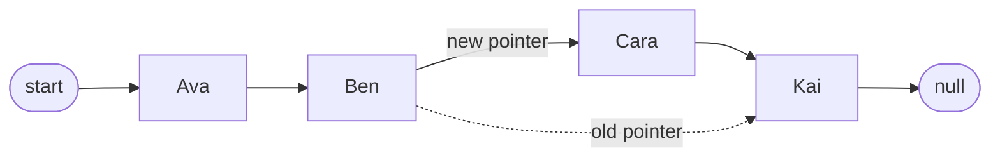
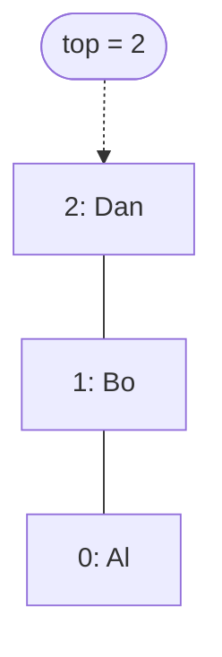
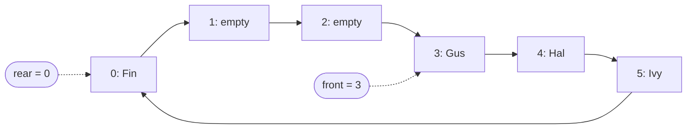
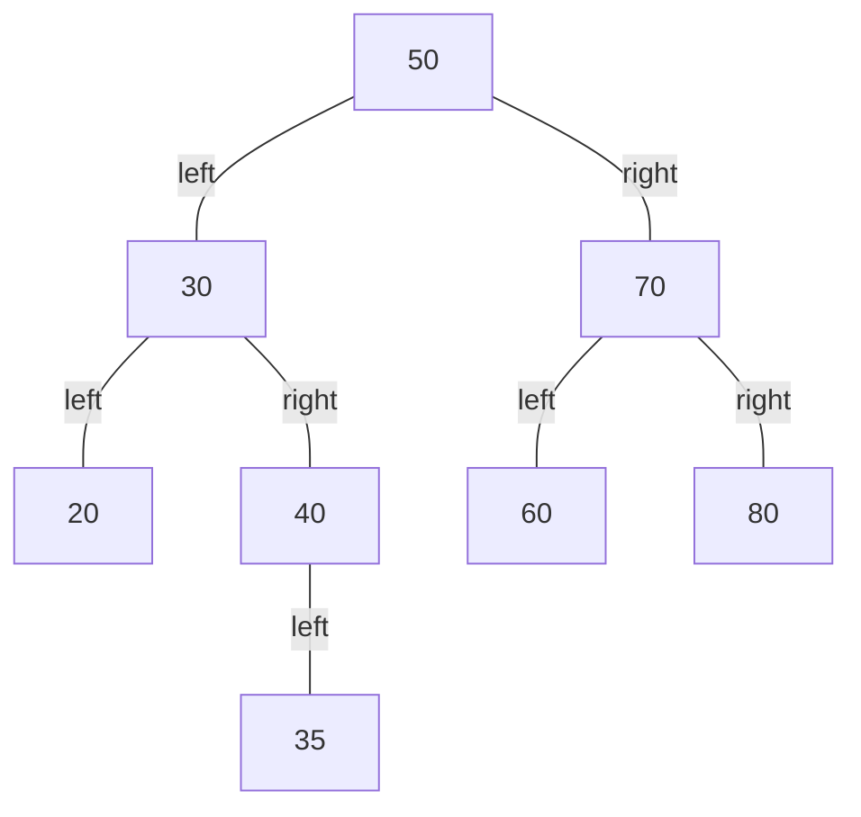
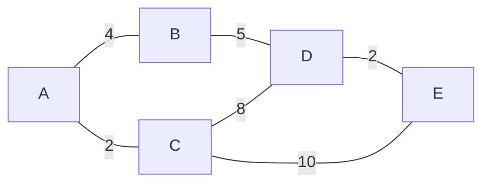
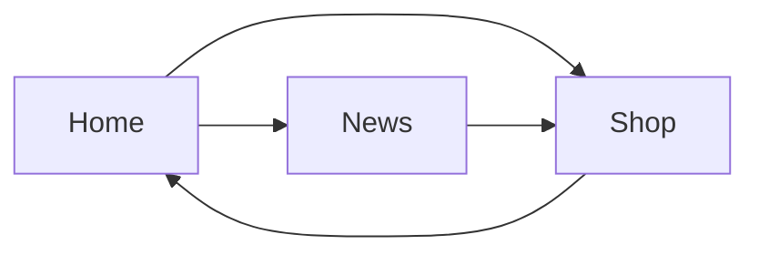

## Arrays, records, lists and tuples

An **array** is an ordered set of elements of the **same type**, under one name. Its size is fixed when it is created: it is a **static** structure. Elements are found by their index, which starts at 0.

```text
array marks[30]           // marks[0] to marks[29]
array board[8,8]          // 2D: board[row, column]
array readings[7,24,3]    // 3D: day, hour, sensor
```

A 2D array is like a table, with rows and columns. A 3D array is like a stack of tables: `readings[2,13,0]` is day 2, hour 13, sensor 0.

To traverse a 2D array, use one loop inside another: the outer loop picks each row and the inner loop visits each column in it.

```text
for row = 0 to 7
    for column = 0 to 7
        print(board[row, column])
    next column
next row
```

A **record** groups **fields** of different types that describe one thing, such as a student with a `surname` (string), `yearGroup` (integer) and `hasLaptop` (Boolean). A field is reached with a dot: `student.surname`.

| Structure | Size | Can its items change? | Item types |
| --- | --- | --- | --- |
| **Array** | Fixed (static) | Yes (mutable) | All the same type |
| **List** | Can grow and shrink (dynamic) | Yes (mutable) | Can be mixed |
| **Tuple** | Fixed | No (**immutable**) | Can be mixed |
| **Record** | Fixed set of named fields | Yes | Each field has its own type |

A **static** structure has a fixed size, so memory can be set aside in advance, but space may be wasted or run out. A **dynamic** structure grows and shrinks while the program runs, using memory only as it needs it.

## Linked lists

A **linked list** is a dynamic structure made of **nodes**. Each node holds some **data** and a **pointer** to the next node, so the nodes need not be next to each other in memory. A **start** pointer gives the first node, and the last node's pointer is **null**.

A linked list can be stored in an array of records, with the free nodes kept in a second linked list. Here `start` is 0, and `free` is 3, the first unused node:

| Index | Data | Next |
| :-: | --- | :-: |
| 0 | Ava | 2 |
| 1 | Kai | null |
| 2 | Ben | 1 |
| 3 | | 4 |
| 4 | | null |

**Traversing:** start at `start` and follow the pointers until you reach null, which visits Ava, Ben, Kai.

```text
current = start
while current != null
    print(list[current].data)
    current = list[current].next
endwhile
```

**Adding** Cara in alphabetical order:

1. Put Cara in the first free node (3), and move `free` on to that node's next free node (4).
2. Follow the pointers to find where Cara goes: after Ben, before Kai.
3. Set Cara's pointer to Ben's old pointer (1, Kai).
4. Set Ben's pointer to Cara (3).



Nothing else moves: only two pointers change. That is why inserting into a linked list is quick, and why the order of the nodes in memory does not matter.

**Removing** Ben: follow the pointers to the node before Ben (Ava) and set its pointer to Ben's next node, so the list skips Ben. Then return Ben's node to the free list. Searching a linked list is slow, because you must follow the pointers one at a time from the start.

## Stacks

A **stack** is a **last in, first out (LIFO)** structure. Items are added and removed at one end only, the **top**. Uses include undo, the back button, reversing data and the call stack, which holds return addresses and local variables while subroutines run.



| Operation | What it does |
| --- | --- |
| `push(item)` | Adds an item to the top |
| `pop()` | Removes and returns the top item |
| `peek()` | Returns the top item without removing it |
| `isEmpty()`, `isFull()` | Check before popping or pushing |

Pushing onto a full stack is **overflow**. Popping from an empty stack is **underflow**. Using an array with `top` starting at −1:

```text
procedure push(item)
    if top == maxSize - 1 then
        print("Stack is full")
    else
        top = top + 1
        stack[top] = item
    endif
endprocedure

function pop()
    if top == -1 then
        print("Stack is empty")
        return null
    else
        item = stack[top]
        top = top - 1
        return item
    endif
endfunction
```

Popping does not wipe the item: it just moves `top` down, and the next push overwrites it.

## Queues

A **queue** is a **first in, first out (FIFO)** structure. Items join at the **rear** and leave from the **front**. Uses include print queues, keyboard buffers and processes waiting for the processor.

- `enqueue(item)` adds an item at the rear. `dequeue()` removes and returns the item at the front.
- The items stay where they are in the array: only the **front** and **rear pointers** move.

In a **linear queue**, both pointers only move forwards, so the space left at the front by dequeued items is never reused. A **circular queue** fixes this. When a pointer passes the last position it wraps round to 0, using `MOD`. This 6-space queue holds Gus, Hal, Ivy and then Fin, which has wrapped round to position 0:



Using an array with `front = 0`, `rear = -1` and `size = 0` to start:

```text
procedure enqueue(item)
    if size == maxSize then
        print("Queue is full")
    else
        rear = (rear + 1) MOD maxSize
        queue[rear] = item
        size = size + 1
    endif
endprocedure

function dequeue()
    if size == 0 then
        print("Queue is empty")
        return null
    else
        item = queue[front]
        front = (front + 1) MOD maxSize
        size = size - 1
        return item
    endif
endfunction
```

In a **priority queue**, each item has a priority: items with a higher priority leave first, and items with the same priority leave in the order they joined.

## Trees

A **tree** is a hierarchy of **nodes** joined by **edges**, with no **cycles** (no route leads back to where it started).

- The **root** is the single node at the top. Every other node has exactly one **parent**.
- A node's **children** are the nodes directly below it. A **leaf** has no children.
- A **subtree** is a node together with everything below it.

In a **binary tree**, each node has at most two children: a left child and a right child.

## Binary search trees

In a **binary search tree** (BST), everything in a node's left subtree is smaller than the node, and everything in its right subtree is larger. Adding 50, 30, 70, 20, 40, 60, 80, 35 in that order gives:



**Adding** an item: start at the root. Go left if the item is smaller than the node, right if it is larger, and repeat until you reach an empty space. Put the item there as a new leaf. 35 is smaller than 50 (left), larger than 30 (right) and smaller than 40 (left).

**Searching** follows the same path. Each comparison discards half of what is left in a balanced tree, so searching is much quicker than checking every item. If you reach an empty space, the item is not in the tree.

**Removing** a node:

- A **leaf** (such as 35): set its parent's pointer to null.
- A node with **one child** (such as 40): link its parent straight to that child.
- A node with **two children** (such as 30): replace its value with the next value in order, its **in-order successor**: the smallest node in its right subtree, here 35. Then remove that node instead. Using the **in-order predecessor**, the largest node in its left subtree, works equally well.

**Traversing:**

| Traversal | Order | Result for the tree above |
| --- | --- | --- |
| **Pre-order** | node, then left subtree, then right subtree | 50, 30, 20, 40, 35, 70, 60, 80 |
| **In-order** | left subtree, then node, then right subtree | 20, 30, 35, 40, 50, 60, 70, 80 |
| **Post-order** | left subtree, then right subtree, then node | 20, 35, 40, 30, 60, 80, 70, 50 |

An in-order traversal of a BST visits the items in **sorted order**. Pre-order is useful for copying a tree, and post-order for deleting one (children before their parent).

A BST can be stored in an array of records, each with a **left pointer**, the **data** and a **right pointer**, using −1 for "no child". For the tree above, with items stored in the order they were added: node 0 holds 50 (left 1, right 2), node 1 holds 30 (left 3, right 4), and node 4 holds 40 (left 7, right −1).

## Graphs

A **graph** is a set of **vertices** (nodes) joined by **edges** (arcs). Unlike a tree, a graph can contain cycles, and there is no root.

- In an **undirected** graph, each edge can be followed both ways. In a **directed** graph (digraph), each edge goes one way only.
- In a **weighted** graph, each edge has a value, such as a distance, time or cost.

A weighted, undirected graph:



A directed graph, such as web pages linking to each other:



There are two ways to store a graph. An **adjacency matrix** is a 2D array with a row and a column for each vertex. Each cell holds the weight of the edge between them, or is blank if there is none. For an undirected graph the matrix is symmetrical about the diagonal.

| | A | B | C | D | E |
| --- | :-: | :-: | :-: | :-: | :-: |
| **A** | | 4 | 2 | | |
| **B** | 4 | | | 5 | |
| **C** | 2 | | | 8 | 10 |
| **D** | | 5 | 8 | | 2 |
| **E** | | | 10 | 2 | |

An **adjacency list** stores, for each vertex, just the vertices it is joined to:

- A: B (4), C (2)
- B: A (4), D (5)
- C: A (2), D (8), E (10)
- D: B (5), C (8), E (2)
- E: C (10), D (2)

| | Adjacency matrix | Adjacency list |
| --- | --- | --- |
| Memory | Space for every pair of vertices | Only stores edges that exist, so better for **sparse** graphs (few edges) |
| Is there an edge from X to Y? | Look up one cell, so quick | Search X's list |
| Good for | **Dense** graphs (many edges) | Graphs with few edges each |

**Adding and removing:** to add a vertex, add a row and a column to the matrix, or a new entry with an empty list. To add an edge, fill in its cell (both cells for an undirected graph), or add it to the vertex's list (both lists for an undirected graph). To remove an edge, blank those cells or remove it from the lists. To remove a vertex, first remove every edge to and from it, then its row and column, or its entry.

**Traversing** a graph visits every vertex once, marking each as visited so loops do not trap you. Taking neighbours in alphabetical order, starting at A:

- **Depth-first** goes as far as possible along one route before backtracking, using a **stack** (or recursion): A, B, D, C, E.
- **Breadth-first** visits all of a vertex's neighbours before moving further away, using a **queue**: A, B, C, D, E.

## Hash tables

A **hash table** stores items so they can be found almost immediately, without searching. A **hashing function** turns an item's key into the index where it is stored, for example `key MOD 11` for an 11-space table.

**Adding** 23, 45, 18, 31 and 56:

| Key | `key MOD 11` | Stored at |
| :-: | :-: | :-: |
| 23 | 1 | 1 |
| 45 | 1 | 2 (1 was taken) |
| 18 | 7 | 7 |
| 31 | 9 | 9 |
| 56 | 1 | 3 (1 and 2 were taken) |

Two keys that hash to the same index cause a **collision**. Finding another space is called **rehashing**. With **linear probing**, the item goes in the next free space, wrapping round to the start of the table if needed. Collisions slow the table down, so tables are made larger than the data, often about 70% full at most. A good hashing function is quick to calculate and spreads keys evenly.

**Searching:** hash the key and look at that index. If the item is not there, keep checking the following spaces until you find it or reach an empty space, which means it is not in the table.

**Removing:** find the item as above, then mark its space as deleted rather than empty, so later searches still probe past it.
