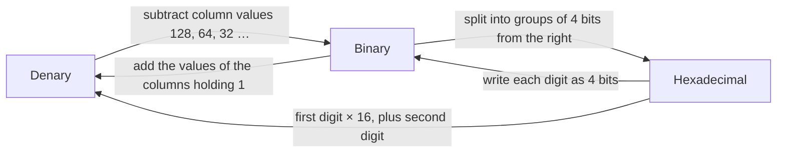
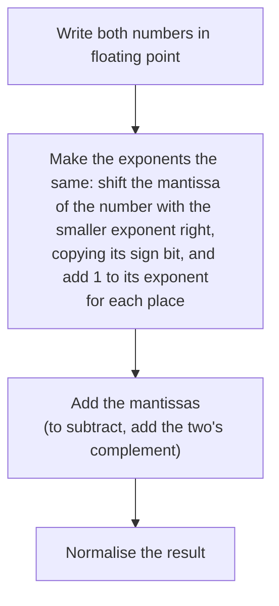

## Primitive data types

A **primitive data type** is one the language provides directly.

| Type | Holds | Examples |
| --- | --- | --- |
| **Integer** | A whole number, positive, negative or zero | `-7`, `0`, `2048` |
| **Real** (floating point) | A number that can have a fractional part | `3.14`, `-0.5`, `12.0` |
| **Character** | A single letter, digit or symbol | `"Q"`, `"7"`, `"#"` |
| **String** | A sequence of characters | `"Hello"`, `"07700 900123"` |
| **Boolean** | One of two values | `true`, `false` |

Choose the type that fits the data. A phone number is a **string**, not an integer: it can start with 0, may contain spaces, and you never do arithmetic on it.

## Binary

Computers store everything in **binary** (base 2). Each column is worth twice the one to its right:

| 128 | 64 | 32 | 16 | 8 | 4 | 2 | 1 |
| :-: | :-: | :-: | :-: | :-: | :-: | :-: | :-: |
| 0 | 1 | 0 | 1 | 1 | 0 | 1 | 0 |

`0101 1010` is 64 + 16 + 8 + 2 = **90**.

To convert denary to binary, work from the largest column: write 1 if the column's value fits into what is left and subtract it, otherwise write 0. With *n* bits, unsigned binary holds 0 to 2<sup>n</sup> − 1, so one byte holds 0 to 255.

## Hexadecimal

**Hexadecimal** (base 16) uses the digits 0 to 9 and then A to F for 10 to 15. One hex digit stands for exactly four bits (a **nibble**), so hex is a short, less error-prone way to write binary. It is used for colour codes, memory addresses and MAC addresses.



- Binary to hex: `0101 1010` splits into `0101` = 5 and `1010` = A, giving `5A`.
- Hex to denary: `3C` = 3 × 16 + 12 = **60**.
- Denary to hex: convert to binary first, then group into nibbles.

## Negative numbers

**Sign and magnitude:** the most significant bit (MSB) is the sign (0 positive, 1 negative) and the other bits are the size. 90 is `0101 1010`, so −90 is `1101 1010`. It is easy to read, but there are two zeros (`0000 0000` and `1000 0000`), and adding the bit patterns gives wrong answers. An 8-bit number holds −127 to 127.

**Two's complement:** the MSB has a **negative** place value (−128 in a byte) and the other columns are positive as usual. An 8-bit number holds **−128 to 127**, with only one zero, and ordinary binary addition gives the right answer. That is why processors use it.

To find the two's complement of a negative number, write the positive version, **flip every bit**, then **add 1**:

| Step | Bits |
| --- | --- |
| +90 | `0101 1010` |
| Flip every bit | `1010 0101` |
| Add 1 | `1010 0110` = −90 |

Check: −128 + 32 + 4 + 2 = −90. Reading a two's complement number is the same as reading unsigned binary, except the MSB counts as −128.

## Adding and subtracting binary

Add column by column from the right: 0 + 0 = 0, 0 + 1 = 1, 1 + 1 = 0 carry 1, and 1 + 1 + 1 = 1 carry 1.

```text
  0101 1010   (90)
+ 0011 0111   (55)
  1111 11     carries
  ---------
  1001 0001   (145)
```

As unsigned binary this is 145, which is right. In 8-bit two's complement the largest number is 127, so the same pattern means −111: the answer has **overflowed**. Overflow happens when a result needs more bits than are available.

To **subtract**, add the two's complement of the second number. For 90 − 55, add 90 and −55 (`1100 1001`):

```text
  0101 1010   (90)
+ 1100 1001   (−55)
  ---------
1 0010 0011   (35, ignoring the carry out of the MSB)
```

## Floating point

A **floating point** number is stored as a **mantissa** and an **exponent**, like standard form: value = mantissa × 2<sup>exponent</sup>. In OCR's questions both parts are in **two's complement**, and the binary point sits just after the mantissa's sign bit.

Example with an 8-bit mantissa and a 4-bit exponent:

- Mantissa `0110 1000` is `0.1101000`. Exponent `0011` is 3.
- Move the binary point 3 places right: `0110.1000`, which is 4 + 2 + 0.5 = **6.5**.
- A negative exponent moves the point left instead.

For a negative mantissa, the sign bit is worth −1. Mantissa `1010 0000` is `1.0100000` = −1 + 0.25 = −0.75. With exponent `0010` (2) the value is −0.75 × 4 = **−3**.

**More bits in the mantissa give more precision. More bits in the exponent give a greater range.**

## Normalisation

A number is **normalised** when the first two bits of the mantissa are different:

- positive: starts `01`
- negative: starts `10`

Normalising makes the best use of the mantissa's bits, so the number is as **precise** as possible. It also gives each value exactly one representation.

To normalise, shift the mantissa's bits left until it starts `01` or `10`, and change the exponent to make up for it: each place the bits move left (the binary point moving right) means subtracting 1 from the exponent.

**Worked example.** `0001 1010` with exponent `0101` (5) is not normalised: it starts `00`.

1. Move the bits 2 places left to get `0110 1000`. The mantissa now starts `01`.
2. Take 2 off the exponent: 5 − 2 = 3, which is `0011`.
3. Check: `0.1101000` × 2<sup>3</sup> = 6.5, the same value as before.

A negative mantissa such as `1110 1000` (exponent `0100`) starts `11`. Shift left 2 places to `1010 0000` and take 2 off the exponent, giving `0010`. Both versions are −3.

To store a denary number, write it in binary (6.5 is `110.1`), move the point to just after a 0 sign bit (`0.1101` × 2<sup>3</sup>), then write the mantissa `0110 1000` and the exponent `0011`.

## Floating point arithmetic



**Worked example.** 6.5 + 1.25

- 6.5 is `0.1101000` × 2<sup>3</sup>. 1.25 is `0.1010000` × 2<sup>1</sup>.
- Make the exponents equal (3): shift the smaller mantissa right 2 places, giving `0.0010100` × 2<sup>3</sup>.
- Add the mantissas: `0.1101000` + `0.0010100` = `0.1111100`. The result is `0.1111100` × 2<sup>3</sup> = `111.11` = **7.75**.
- It already starts `01`, so it is normalised.

**Subtracting.** For 6.5 − 1.25, add the two's complement of the second mantissa. After lining up the exponents, 1.25's mantissa is `0001 0100`, so its two's complement is `1110 1100`:

```text
  0110 1000   (6.5, exponent 3)
+ 1110 1100   (−1.25, exponent 3)
  ---------
1 0101 0100   ignore the carry out: 0.1010100 × 2³ = 101.01 = 5.25
```

**With a negative number.** −3 + 1.25:

- −3 is mantissa `1010 0000`, exponent `0010` (2). 1.25 is mantissa `0101 0000`, exponent `0001` (1).
- 1.25 has the smaller exponent, so shift its mantissa right 1 place to `0010 1000` and make its exponent 2. (Shifting a negative mantissa right copies its sign bit, so it fills with 1s.)
- Add: `1010 0000` + `0010 1000` = `1100 1000`, exponent 2. That is −0.4375 × 4 = −1.75.
- The mantissa starts `11`, so it is not normalised. Shift it left 1 place to `1001 0000` and take 1 off the exponent, giving `0001`. The answer is still **−1.75**.

## Shifts and masks

A **logical shift** moves every bit left or right and fills the gap with 0. The bit shifted out is lost (processors keep it in the carry flag).

- Logical shift left by 1 doubles an unsigned number: `0001 0110` (22) becomes `0010 1100` (44).
- Logical shift right by 2 divides by 4: `0101 1000` (88) becomes `0001 0110` (22).

An **arithmetic shift** keeps a two's complement number's sign. Shifting right copies the sign bit into the gap, dividing by 2: `1110 1000` (−24) becomes `1111 0100` (−12). Shifting left multiplies by 2 while the sign bit stays the same: `1111 0100` (−12) becomes `1110 1000` (−24). A **circular shift** (rotate) puts the bit that falls off one end back in at the other. Some books rotate through the carry flag, so the bit that falls off goes into the carry and the old carry comes in at the other end.

A **mask** is a bit pattern combined with a value, bit by bit, using a logical operator:

| Operator | Effect where the mask has a 1 | Effect where the mask has a 0 | Example with `1011 0110` |
| --- | --- | --- | --- |
| **AND** | keeps the bit | clears it to 0 | AND `0000 1111` → `0000 0110` |
| **OR** | sets it to 1 | keeps the bit | OR `0000 0001` → `1011 0111` |
| **XOR** | flips (toggles) the bit | keeps the bit | XOR `1111 0000` → `0100 0110` |

AND masks check or clear bits, OR masks set bits, and XOR masks toggle bits.

## Character sets

A **character set** gives every character a unique binary code. Text is stored as a sequence of these codes.

- **ASCII** uses **7 bits**, so it has 2<sup>7</sup> = **128** characters: English letters, digits, punctuation and control codes. Extended ASCII uses 8 bits for 256 characters.
- **Unicode** uses up to 32 bits per character (encodings use 8, 16 or 32 bits at a time), enough for over a million characters. It covers the world's alphabets, symbols and emoji. Its first 128 codes are the same as ASCII.
- Unicode text can take more storage than ASCII text, because each character may need more bits.

Codes run in order, so `"A"` is 65 and `"B"` is 66. Lowercase `"a"` is 97, which is 32 more than `"A"`: the two differ in one bit, so an XOR mask of `0010 0000` switches the case of a letter. The **character** `"7"` has code 55 (`0011 0111`), which is not the same as the **number** 7 (`0000 0111`).
